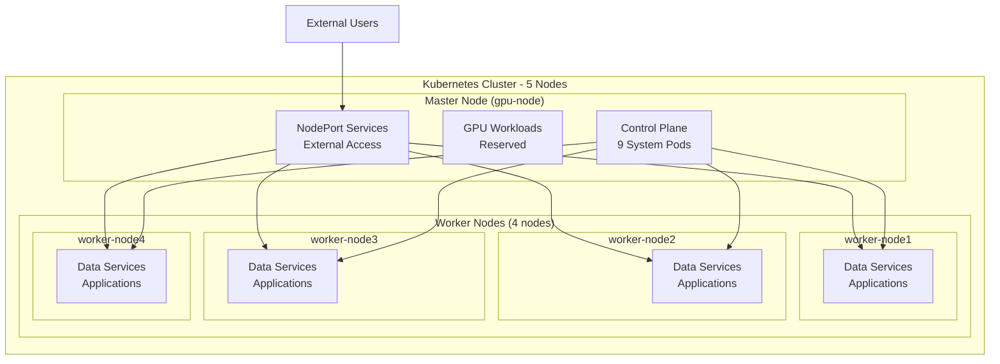
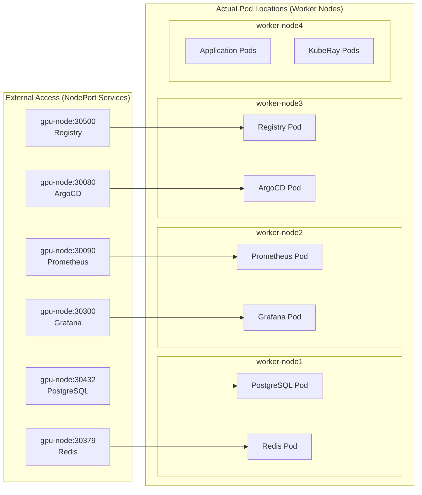
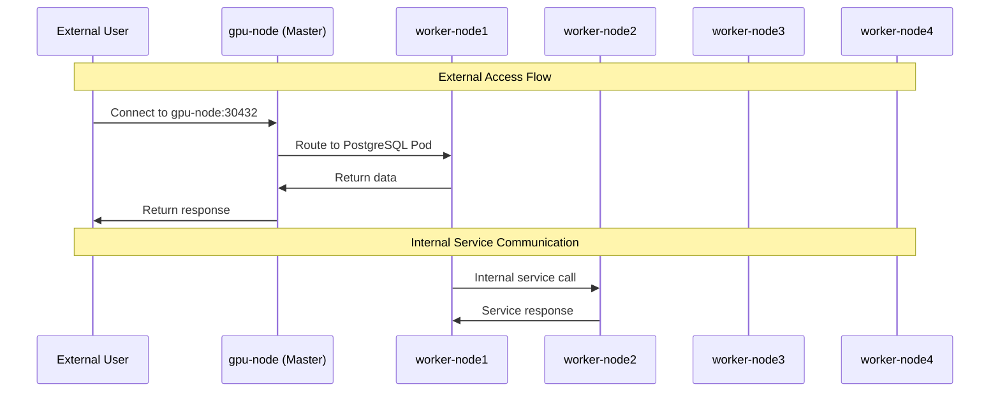

# 🚀 Kubernetes Cluster Distribution Update Summary

## 📋 Overview

Successfully updated the entire Kubernetes infrastructure to distribute workloads across the 5-node cluster instead of being pinned to the old master node (`sanzad-ubuntu-21`). The new cluster uses `gpu-node` as the master and distributes all services across the worker nodes for optimal performance.

## 🏗️ New Cluster Architecture

### **Node Configuration**
| Node | Role | IP | Resources | Purpose |
|------|------|----|-----------|---------|
| **gpu-node** | Master (Control Plane) | 192.168.1.79 | 4 CPU, 15GB RAM, GPU | Control plane + GPU workloads |
| **worker-node1** | Worker | 192.168.1.95 | 3 CPU, 11GB RAM | Data services + applications |
| **worker-node2** | Worker | 192.168.1.132 | 3 CPU, 11GB RAM | Data services + applications |
| **worker-node3** | Worker | 192.168.1.105 | 3 CPU, 11GB RAM | Data services + applications |
| **worker-node4** | Worker | 192.168.1.137 | 3 CPU, 11GB RAM | Data services + applications |

## 🎯 Detailed Architecture Diagrams

### **1. Overall Cluster Architecture**


### **2. Service Distribution Architecture**


### **3. Network Flow Architecture**


## 📖 Plain English Architecture Explanation

### **What Actually Happens:**

#### **1. Pod Placement (Where Workloads Actually Run)**
- **PostgreSQL Database**: Runs on a worker node (e.g., worker-node1)
- **Redis Cache**: Runs on a worker node (e.g., worker-node1) 
- **Prometheus Monitoring**: Runs on a worker node (e.g., worker-node2)
- **Grafana Dashboard**: Runs on a worker node (e.g., worker-node2)
- **Container Registry**: Runs on a worker node (e.g., worker-node3)
- **ArgoCD GitOps**: Runs on a worker node (e.g., worker-node3)
- **Applications**: Distributed across all worker nodes

#### **2. External Access (How You Connect)**
- **NodePort Services**: Expose services on ALL nodes (including gpu-node)
- **External URLs**: Use `gpu-node:PORT` because it's the master node
- **Load Distribution**: Kubernetes routes requests to actual pod locations
- **High Availability**: If gpu-node is down, you can access via any worker node

#### **3. Master Node Responsibilities**
- **Control Plane**: 9 system pods (etcd, API server, scheduler, etc.)
- **External Gateway**: NodePort service endpoints for external access
- **GPU Workloads**: Reserved for GPU-intensive applications
- **Network Routing**: Routes external requests to worker nodes

#### **4. Worker Node Responsibilities**
- **Data Services**: PostgreSQL, Redis, Kafka, etc.
- **Applications**: All application workloads
- **Monitoring**: Prometheus, Grafana, etc.
- **Infrastructure**: Container registry, Helm repository, etc.

### **Why This Architecture is Optimal:**

#### **✅ Performance Benefits**
- **Load Distribution**: Heavy workloads spread across 4 worker nodes
- **Resource Isolation**: Control plane doesn't compete with applications
- **GPU Optimization**: GPU node dedicated to GPU workloads
- **Scalability**: Easy to add more worker nodes

#### **✅ Reliability Benefits**
- **No Single Point of Failure**: Services distributed across multiple nodes
- **High Availability**: External access works even if some nodes fail
- **Fault Tolerance**: Pods can be rescheduled to healthy nodes

#### **✅ Operational Benefits**
- **Clear Separation**: Control plane vs. application workloads
- **Easy Management**: Predictable pod placement with node selectors
- **Monitoring**: Clear visibility into workload distribution

## 🔧 Updated Components

### **1. Platform Services** (`platform-services/`)

#### **PostgreSQL** (`helm-values/postgresql-values.yaml`)
- ✅ **Before**: Pinned to `sanzad-ubuntu-21`
- ✅ **After**: Distributed across worker nodes (`node-role: worker`)
- ✅ **Reasoning**: Data workloads avoid master node for better performance

#### **Redis** (`helm-values/redis-values.yaml`)
- ✅ **Before**: Pinned to `sanzad-ubuntu-21`
- ✅ **After**: Distributed across worker nodes (`node-role: worker`)
- ✅ **Reasoning**: Memory-intensive, benefits from worker distribution

#### **Monitoring Stack** (`helm-values/monitoring-values.yaml`)
- ✅ **Before**: Pinned to `sanzad-ubuntu-21`
- ✅ **After**: Distributed across worker nodes (`node-role: worker`)
- ✅ **Reasoning**: Monitoring data storage on workers, UI distributed for better access

### **2. Infrastructure Components** (`infrastructure/`)

#### **Container Registry** (`container-registry/registry-deployment.yaml`)
- ✅ **Before**: Pinned to `sanzad-ubuntu-21`
- ✅ **After**: Distributed across worker nodes (`node-role: worker`)
- ✅ **Reasoning**: Registry storage and access distributed across cluster

#### **ArgoCD** (`argocd/install-argocd.sh`)
- ✅ **Before**: Referenced `sanzad-ubuntu-21:30080`
- ✅ **After**: Updated to `gpu-node:30080`
- ✅ **Reasoning**: Consistent with new master node

#### **ChartMuseum** (`helm-repository/chartmuseum-deploy.yaml`)
- ✅ **Before**: Pinned to `sanzad-ubuntu-21`
- ✅ **After**: Distributed across worker nodes (`node-role: worker`)
- ✅ **Reasoning**: Helm repository distributed for better access

### **3. Applications** (`applications/`)

#### **Sample Applications**
- ✅ **Before**: Referenced `sanzad-ubuntu-21` for access
- ✅ **After**: Updated to `gpu-node` for external access
- ✅ **Reasoning**: Consistent external access point

### **4. KubeRay** (`kuberay/`)

#### **Ray Cluster** (`ray-cluster.yaml`)
- ✅ **Before**: No node selection specified
- ✅ **After**: Distributed across worker nodes (`node-role: worker`)
- ✅ **Reasoning**: Distributed computing across all workers, avoids master

### **5. Documentation Updates**

#### **README Files Updated**
- ✅ `platform-services/README.md` - Added distribution strategy section
- ✅ `applications/README.md` - Updated access URLs and added distribution strategy
- ✅ `kuberay/README.md` - Updated architecture diagrams and distribution strategy
- ✅ `README.md` - Updated all service URLs and access information

## 🎯 Benefits Achieved

### **Performance Benefits**
- **Load Distribution**: Workloads spread across 4 worker nodes instead of single master
- **Resource Optimization**: Master node reserved for control plane and GPU workloads
- **Better Scalability**: Services can scale horizontally across worker nodes
- **Improved Reliability**: No single point of failure for data services

### **Operational Benefits**
- **Intelligent Scheduling**: Kubernetes scheduler optimizes pod placement
- **Resource Isolation**: Control plane isolated from application workloads
- **GPU Optimization**: GPU node dedicated to GPU workloads
- **Easy Scaling**: Add more worker nodes for additional capacity

### **Maintenance Benefits**
- **Consistent Configuration**: All services use `node-role: worker` selector
- **Future-Proof**: Easy to add/remove worker nodes without reconfiguration
- **Standard Patterns**: Follows Kubernetes best practices for node selection

## 🚀 Quick Access URLs

### **Platform Services** (Distributed across cluster)
- **PostgreSQL**: `gpu-node:30432`
- **Redis**: `gpu-node:30379`
- **Kafka**: `gpu-node:30092`
- **Prometheus**: `http://gpu-node:30090`
- **Grafana**: `http://gpu-node:30300`

### **Development Infrastructure** (Distributed across cluster)
- **Container Registry**: `gpu-node:30500`
- **ArgoCD GitOps**: `http://gpu-node:30080`
- **ChartMuseum**: `http://gpu-node:30800`

### **Applications** (Distributed across cluster)
- **TweetStream Frontend**: `http://gpu-node:30951`
- **TweetStream Backend**: `http://gpu-node:30950`
- **Sample Web App**: `http://gpu-node:30900`

## 🔍 Verification Commands

```bash
# Check cluster status
kubectl get nodes -o wide

# Check node labels
kubectl get nodes --show-labels

# Check platform services distribution
kubectl get pods -n platform-services -o wide

# Check infrastructure distribution
kubectl get pods -n container-registry -o wide
kubectl get pods -n chartmuseum -o wide
kubectl get pods -n argocd -o wide

# Check application distribution
kubectl get pods -n applications -o wide

# Check KubeRay distribution
kubectl get pods -n kuberay -o wide

# Check NodePort services
kubectl get svc --all-namespaces | grep NodePort
```

## 📝 Next Steps

1. **Deploy Platform Services**: Run `./deploy-platform-services.sh` to deploy distributed services
2. **Deploy Infrastructure**: Run `./deploy-infrastructure.sh` to deploy distributed infrastructure
3. **Deploy Applications**: Deploy applications using the updated configurations
4. **Monitor Distribution**: Use `kubectl get pods -o wide` to verify proper distribution
5. **Test Performance**: Monitor resource usage across nodes to verify load distribution

## ✅ Status

**🎉 COMPLETE** - All components successfully updated for intelligent cluster distribution!

- ✅ **Cluster**: 5-node cluster operational with proper labels
- ✅ **Platform Services**: Updated for worker node distribution
- ✅ **Infrastructure**: Updated for worker node distribution  
- ✅ **Applications**: Updated for worker node distribution
- ✅ **KubeRay**: Updated for worker node distribution
- ✅ **Documentation**: All README files updated with new URLs and strategies
- ✅ **Node Labels**: Proper `node-role=worker` labels applied

The cluster is now ready for intelligent workload distribution across all nodes! 