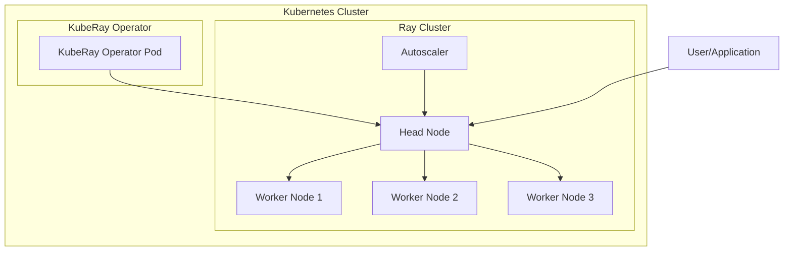
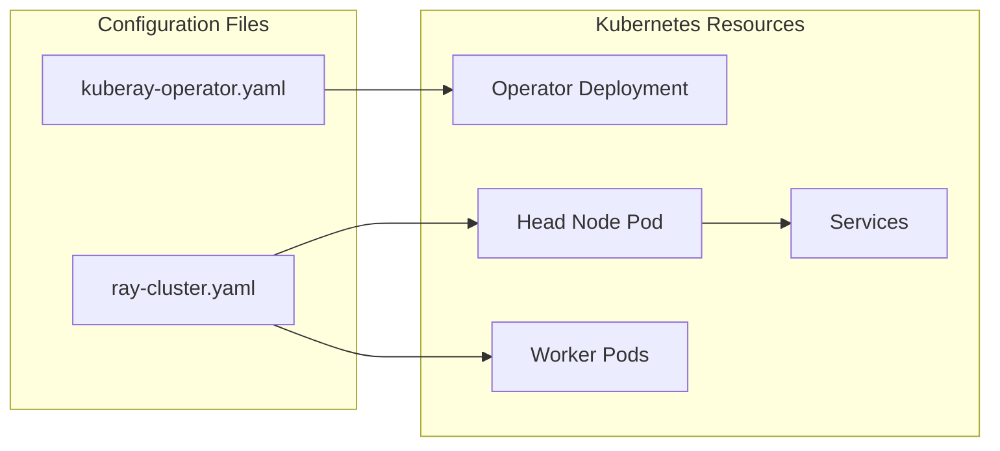
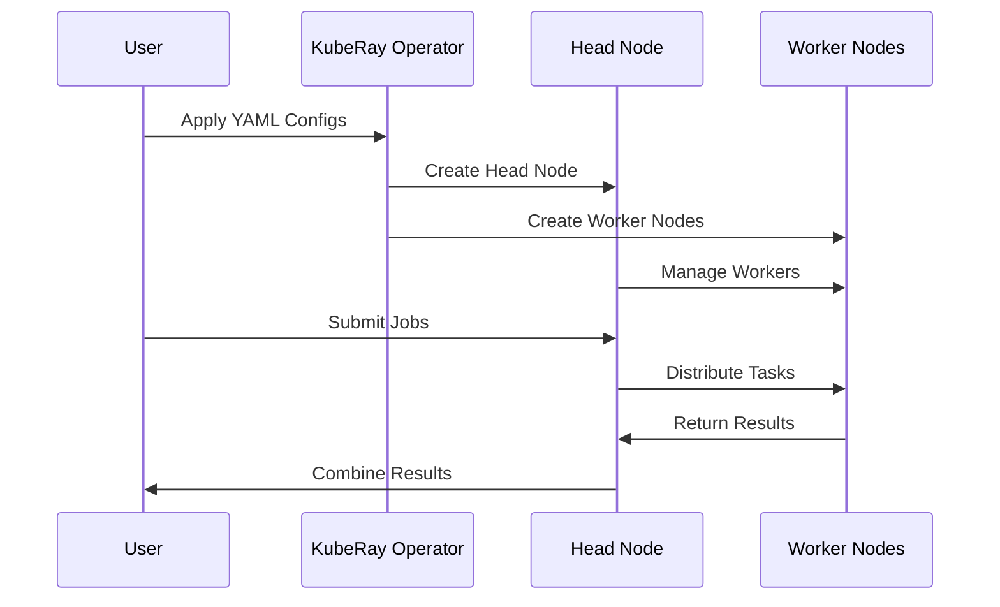
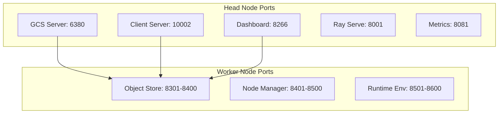
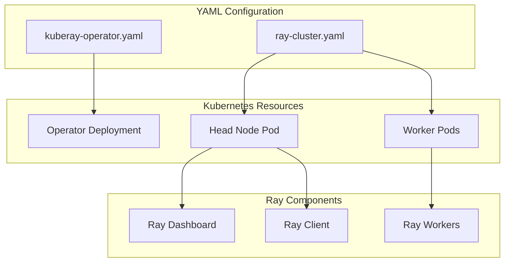
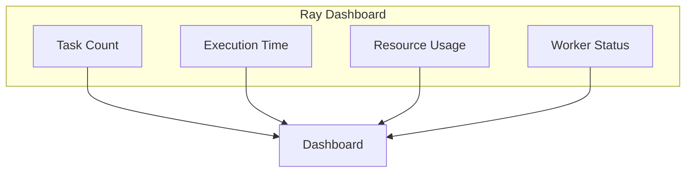

# KubeRay - Ray Cluster on Kubernetes

Part of the **[Kubernetes Infrastructure Repository](../README.md)** ecosystem.

## 📋 Table of Contents
1. [Overview](#overview)
2. [Architecture](#architecture)
3. [Configuration](#configuration)
4. [Quick Start](#quick-start)
5. [Usage Examples](#usage-examples)
6. [Monitoring & Debugging](#monitoring--debugging)
7. [Troubleshooting](#troubleshooting)
8. [Best Practices](#best-practices)
9. [Future Considerations](#future-considerations)
10. [Learning Resources](#learning-resources)

## 🎯 Overview

KubeRay provides distributed computing capabilities using Ray framework on our Kubernetes platform. Think of it as a system that can automatically distribute your computing tasks across multiple machines, making your applications run faster and more efficiently.

## 🏗️ Architecture

### High-Level Architecture


### Configuration Flow


### Component Interaction


## ⚙️ Configuration

### Port Management

Ray requires specific ports for different components. Here's how we manage them, avoiding conflicts with existing services:



#### Head Node Port Configuration
```yaml
headGroupSpec:
  template:
    spec:
      containers:
      - name: ray-head
        ports:
        - containerPort: 6380  # Changed from 6379 to avoid Redis conflict
          name: gcs-server
          protocol: TCP
        - containerPort: 10002 # Changed from 10001 to avoid potential conflicts
          name: client-server
          protocol: TCP
        - containerPort: 8266  # Changed from 8265 to avoid potential conflicts
          name: dashboard
          protocol: TCP
        - containerPort: 8001  # Changed from 8000 to avoid conflicts
          name: ray-serve
          protocol: TCP
        - containerPort: 8081  # Changed from 8080 to avoid ChartMuseum conflict
          name: metrics
          protocol: TCP
```

#### Worker Node Port Configuration
```yaml
workerGroupSpecs:
  - groupName: small-group
    template:
      spec:
        containers:
        - name: ray-worker
          ports:
          # Object Store Ports (moved to higher range)
          - containerPort: 8301
            name: object-store-start
            protocol: TCP
          - containerPort: 8400
            name: object-store-end
            protocol: TCP
          # Node Manager Ports (moved to higher range)
          - containerPort: 8401
            name: node-manager-start
            protocol: TCP
          - containerPort: 8500
            name: node-manager-end
            protocol: TCP
          # Runtime Environment Ports (moved to higher range)
          - containerPort: 8501
            name: runtime-env-start
            protocol: TCP
          - containerPort: 8600
            name: runtime-env-end
            protocol: TCP
```

### Network Policy

Updated NetworkPolicy to reflect new port assignments:

```yaml
apiVersion: networking.k8s.io/v1
kind: NetworkPolicy
metadata:
  name: ray-cluster-network-policy
spec:
  podSelector:
    matchLabels:
      ray.io/cluster: raycluster-autoscaler
  policyTypes:
  - Ingress
  - Egress
  ingress:
  - from:
    - podSelector:
        matchLabels:
          ray.io/cluster: raycluster-autoscaler
    ports:
    - protocol: TCP
      port: 6380  # GCS Server
    - protocol: TCP
      port: 10002 # Client Server
    - protocol: TCP
      port: 8266  # Dashboard
    - protocol: TCP
      port: 8001  # Ray Serve
    - protocol: TCP
      port: 8081  # Metrics
    - protocol: TCP
      portRange:
        min: 8301
        max: 8600  # Worker port ranges
  egress:
  - to:
    - podSelector:
        matchLabels:
          ray.io/cluster: raycluster-autoscaler
    ports:
    - protocol: TCP
      port: 6380
    - protocol: TCP
      port: 10002
    - protocol: TCP
      port: 8266
    - protocol: TCP
      port: 8001
    - protocol: TCP
      port: 8081
    - protocol: TCP
      portRange:
        min: 8301
        max: 8600
```

### Port Usage Explanation

1. **Head Node Ports** (Changed to avoid conflicts):
   - `6380`: GCS server (was 6379, conflicted with Redis)
   - `10002`: Client server (was 10001)
   - `8266`: Dashboard (was 8265)
   - `8001`: Ray Serve (was 8000)
   - `8081`: Metrics (was 8080, conflicted with ChartMuseum)

2. **Worker Node Ports** (Moved to higher ranges):
   - `8301-8400`: Object Store ports
   - `8401-8500`: Node Manager ports
   - `8501-8600`: Runtime Environment ports

3. **Port Management Best Practices**:
   - Each port has a specific name for clarity
   - Port ranges are documented
   - NetworkPolicy ensures secure communication
   - Ports are properly exposed in services
   - Port assignments avoid conflicts with existing services

### Port Conflict Resolution

We've resolved the following conflicts:
1. Redis (6379) → Ray GCS (6380)
2. ChartMuseum (8080) → Ray Metrics (8081)
3. Various services (8000) → Ray Serve (8001)
4. Moved worker port ranges to higher numbers (8301-8600)

### KubeRay Operator Configuration (`kuberay-operator.yaml`)

```yaml
apiVersion: ray.io/v1alpha1
kind: RayCluster
metadata:
  name: raycluster-autoscaler
spec:
  rayVersion: '2.9.0'
  headGroupSpec:
    serviceType: ClusterIP
    template:
      spec:
        containers:
        - name: ray-head
          image: rayproject/ray:2.9.0
          ports:
          - containerPort: 6380  # Changed from 6379 to avoid Redis conflict
          - containerPort: 10002 # Changed from 10001 to avoid potential conflicts
          - containerPort: 8266  # Changed from 8265 to avoid potential conflicts
          resources:
            limits:
              cpu: "1"
              memory: "1Gi"
            requests:
              cpu: "500m"
              memory: "512Mi"
```

#### Operator Configuration Explained:

1. **Basic Setup**:
   - `apiVersion: ray.io/v1alpha1`: Uses Ray's custom resource definition
   - `kind: RayCluster`: Defines this as a Ray cluster resource
   - `name: raycluster-autoscaler`: Unique identifier for this cluster

2. **Head Node Configuration**:
   - `rayVersion: '2.9.0'`: Specific Ray version to use
   - `serviceType: ClusterIP`: Makes head node accessible within cluster
   - `ports`: Three essential ports:
     - `6380`: Ray's internal communication
     - `10002`: Client connections
     - `8266`: Web dashboard

3. **Resource Management**:
   ```yaml
   resources:
     limits:
       cpu: "1"        # Maximum CPU allowed
       memory: "1Gi"   # Maximum memory allowed
     requests:
       cpu: "500m"     # Minimum CPU guaranteed
       memory: "512Mi" # Minimum memory guaranteed
   ```

### Ray Cluster Configuration (`ray-cluster.yaml`)

```yaml
  workerGroupSpecs:
  - groupName: small-group
    replicas: 1
    minReplicas: 1
    maxReplicas: 5
    template:
      spec:
        containers:
        - name: ray-worker
          image: rayproject/ray:2.9.0
          resources:
            limits:
              cpu: "1"
              memory: "1Gi"
            requests:
              cpu: "500m"
              memory: "512Mi"
```

#### Worker Configuration Explained:

1. **Worker Group Settings**:
   - `groupName: small-group`: Identifier for this worker group
   - `replicas: 1`: Initial number of workers
   - `minReplicas: 1`: Minimum workers to maintain
   - `maxReplicas: 5`: Maximum workers allowed

2. **Autoscaling Behavior**:
   ```mermaid
   graph LR
       subgraph "Workload Changes"
           W1[Low Load] --> W2[High Load]
           W2 --> W3[Low Load]
       end
       
       subgraph "Cluster Response"
           N1[1 Worker] --> N2[5 Workers]
           N2 --> N3[1 Worker]
       end
       
       W1 --> N1
       W2 --> N2
       W3 --> N3
   ```

3. **Resource Configuration**:
   - Each worker gets:
     - 1 CPU core maximum
     - 1Gi memory maximum
     - 500m CPU guaranteed
     - 512Mi memory guaranteed

### Configuration Flow Diagram



## 🚀 Quick Start

1. **Deploy KubeRay Operator**:
   ```bash
   # This creates the operator that will manage Ray clusters
   kubectl apply -f kuberay-operator.yaml
   
   # Verify the operator is running
   kubectl get pods -n kuberay
   ```

2. **Deploy Ray Cluster**:
   ```bash
   # This creates your Ray cluster with autoscaling
   kubectl apply -f ray-cluster.yaml
   
   # Check the status of your Ray cluster
   kubectl get rayclusters -n kuberay
   ```

3. **Access the Dashboard**:
   ```bash
   # This makes the Ray dashboard available on your local machine
   kubectl port-forward -n kuberay svc/raycluster-autoscaler-head-svc 8265:8265
   ```
   Then open: http://localhost:8265

## 🎮 Usage Examples

### Basic Ray Job
```python
# Python code to submit a job to Ray
import ray
ray.init(address="ray://raycluster-autoscaler-head-svc:10001")

@ray.remote
def process_data(data):
    return data * 2

# Submit job to Ray cluster
result = ray.get(process_data.remote(42))
print(result)  # Output: 84
```

### Data Processing Pipeline
```python
# Example of distributed data processing
import ray
from ray import train
from ray.train import ScalingConfig
from ray.train.torch import TorchTrainer

# Initialize Ray
ray.init(address="ray://raycluster-autoscaler-head-svc:10001")

# Define training function
def train_func():
    # Your training code here
    pass

# Create trainer
trainer = TorchTrainer(
    train_func,
    scaling_config=ScalingConfig(
        num_workers=3,
        use_gpu=False
    )
)

# Start training
result = trainer.fit()
```

## 🔄 How It All Works Together

1. **Initialization**:
   - KubeRay Operator creates the Ray head node
   - Head node starts with configured resources
   - Initial worker nodes are created

2. **Job Submission**:
   - Application connects to Ray head node
   - Head node distributes work to workers
   - Workers process tasks and return results

3. **Autoscaling**:
   - Operator monitors resource usage
   - Scales workers up when needed
   - Scales workers down when idle

4. **Failure Handling**:
   - Operator detects node failures
   - Automatically replaces failed nodes
   - Maintains cluster health

## 📈 Monitoring and Metrics

The Ray dashboard provides real-time insights:



Key metrics in our sample app:
- `sample_app_tasks_completed`: How many tasks finished
- `sample_app_task_latency`: How long tasks took

## 🔍 Monitoring and Debugging

```bash
# Check Ray cluster status
kubectl get rayclusters

# View Ray dashboard
kubectl port-forward svc/raycluster-autoscaler-head-svc 8265:8265

# Check worker logs
kubectl logs -l ray.io/node-type=worker
```

## 🔧 Troubleshooting

Common issues and solutions:

1. **Cluster Not Starting**:
   ```bash
   # Check operator logs
   kubectl logs -n kuberay -l app=kuberay-operator
   
   # Check head node logs
   kubectl logs -n kuberay -l ray.io/node-type=head
   ```

2. **Workers Not Scaling**:
   ```bash
   # Check autoscaler logs
   kubectl logs -n kuberay -l ray.io/node-type=head | grep autoscaler
   ```

3. **Application Errors**:
   ```bash
   # Check worker logs
   kubectl logs -n kuberay -l ray.io/node-type=worker
   ```

4. **Worker Scaling Issues**:
   ```bash
   # Check worker status
   kubectl get pods -l ray.io/node-type=worker
   
   # Check operator logs
   kubectl logs -l app.kubernetes.io/name=kuberay-operator
   ```

5. **Connection Issues**:
   ```bash
   # Verify head node service
   kubectl get svc raycluster-autoscaler-head-svc
   
   # Check network policies
   kubectl get networkpolicies
   ```

6. **Resource Issues**:
   ```bash
   # Check resource usage
   kubectl top pods -l ray.io/node-type=head
   kubectl top pods -l ray.io/node-type=worker
   ```

## 📈 Best Practices

1. **Resource Planning**:
   - Set appropriate resource limits
   - Monitor usage patterns
   - Adjust based on workload

2. **Autoscaling Configuration**:
   - Start with conservative limits
   - Monitor scaling behavior
   - Adjust based on performance

3. **Application Design**:
   - Design for distributed execution
   - Handle failures gracefully
   - Use Ray's built-in features

## 🚀 Future Considerations

1. **GPU Support**:
   - Configure GPU resources
   - Optimize for ML workloads
   - Monitor GPU utilization

2. **Multi-Cluster Setup**:
   - Deploy across regions
   - Handle cross-cluster communication
   - Manage resource distribution

3. **Advanced Features**:
   - Custom resource definitions
   - Advanced autoscaling policies
   - Integration with other services

## 🎓 Learning Resources

1. **Official Documentation**:
   - [KubeRay Documentation](https://docs.ray.io/en/latest/cluster/kubernetes/index.html)
   - [Ray Documentation](https://docs.ray.io/en/latest/)

2. **Example Projects**:
   - [Ray Examples](https://github.com/ray-project/ray/tree/master/python/ray/examples)
   - [KubeRay Examples](https://github.com/ray-project/kuberay/tree/master/ray-operator/config/samples)

## 🔗 Related Components

- **[Platform Services](../platform-services/README.md)** - Shared infrastructure
- **[Infrastructure](../infrastructure/README.md)** - Container registry and GitOps platform
- **[Main Repository](../README.md)** - Complete Kubernetes ecosystem overview

---
**Status**: ✅ **ACTIVE** - Ready for use with autoscaling capabilities 

Remember: KubeRay is a powerful tool, but like any tool, it requires proper configuration and understanding to use effectively. Start small, monitor carefully, and scale up as needed! 🚀 