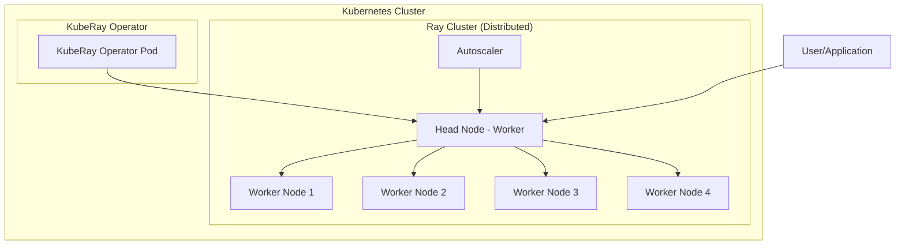
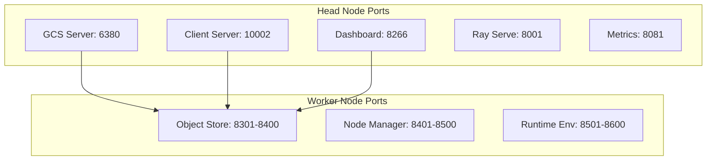

# KubeRay - Ray Cluster on Kubernetes

Part of the **[Kubernetes Infrastructure Repository](../README.md)** ecosystem.

## 📋 Table of Contents
1. [Overview](#overview)
2. [Architecture](#architecture)
3. [Deployment Options](#deployment-options)
4. [Quick Start](#quick-start)
5. [Usage Examples](#usage-examples)
6. [Monitoring & Debugging](#monitoring--debugging)
7. [Troubleshooting](#troubleshooting)
8. [Best Practices](#best-practices)
9. [Future Considerations](#future-considerations)
10. [Learning Resources](#learning-resources)

## 🎯 Overview

KubeRay provides distributed computing capabilities using Ray framework on our Kubernetes platform. Think of it as a system that can automatically distribute your computing tasks across multiple machines, making your applications run faster and more efficiently.

## 🏗️ Architecture

### High-Level Architecture


### Cluster Distribution Strategy
Our KubeRay cluster is intelligently distributed across the 5-node Kubernetes cluster:

| Component | Node Selection | Reasoning |
|-----------|---------------|-----------|
| **Ray Head Node** | Worker nodes only | Avoids master node for data workloads |
| **Ray Worker Nodes** | All worker nodes | Distributed computing across cluster |
| **Autoscaler** | Worker nodes | Monitors and scales worker pods |
| **Dashboard** | Worker nodes | Web UI accessible from any worker |

### Resource Optimization
- **Master Node (gpu-node)**: Reserved for control plane and GPU workloads
- **Worker Nodes**: Handle all Ray computing workloads
- **Auto-scaling**: Automatically scales workers based on demand

## 🚀 Deployment Options

### **Option 1: Direct YAML Deployment (Current)**
```bash
# Deploy operator
kubectl apply -f kuberay-operator.yaml

# Deploy Ray cluster
kubectl apply -f ray-cluster.yaml
```

### **Option 2: Official Helm Chart Deployment (Recommended)**
```bash
# Using official KubeRay Helm repository
helm repo add kuberay https://ray-project.github.io/kuberay-helm/
helm install kuberay-operator kuberay/kuberay-operator --namespace kuberay --create-namespace
helm install ray-cluster kuberay/ray-cluster --namespace kuberay
```

### **Option 3: Automated Deployment Script**
```bash
# Use our deployment script (uses official charts)
./deploy-kuberay.sh
```

## ⚙️ Configuration

### **Port Management**

Ray requires specific ports for different components. Here's how we manage them, avoiding conflicts with existing services:



#### Head Node Port Configuration
```yaml
headGroupSpec:
  template:
    spec:
      containers:
      - name: ray-head
        ports:
        - containerPort: 6380  # Changed from 6379 to avoid Redis conflict
          name: gcs-server
          protocol: TCP
        - containerPort: 10002 # Changed from 10001 to avoid potential conflicts
          name: client-server
          protocol: TCP
        - containerPort: 8266  # Changed from 8265 to avoid potential conflicts
          name: dashboard
          protocol: TCP
        - containerPort: 8001  # Changed from 8000 to avoid conflicts
          name: ray-serve
          protocol: TCP
        - containerPort: 8081  # Changed from 8080 to avoid ChartMuseum conflict
          name: metrics
          protocol: TCP
```

#### Worker Node Port Configuration
```yaml
workerGroupSpecs:
  - groupName: small-group
    template:
      spec:
        containers:
        - name: ray-worker
          ports:
          # Object Store Ports (moved to higher range)
          - containerPort: 8301
            name: object-store-start
            protocol: TCP
          - containerPort: 8400
            name: object-store-end
            protocol: TCP
          # Node Manager Ports (moved to higher range)
          - containerPort: 8401
            name: node-manager-start
            protocol: TCP
          - containerPort: 8500
            name: node-manager-end
            protocol: TCP
          # Runtime Environment Ports (moved to higher range)
          - containerPort: 8501
            name: runtime-env-start
            protocol: TCP
          - containerPort: 8600
            name: runtime-env-end
            protocol: TCP
```

### **Network Policy**

Updated NetworkPolicy to reflect new port assignments:

```yaml
apiVersion: networking.k8s.io/v1
kind: NetworkPolicy
metadata:
  name: ray-cluster-network-policy
spec:
  podSelector:
    matchLabels:
      ray.io/cluster: raycluster-autoscaler
  policyTypes:
  - Ingress
  - Egress
  ingress:
  - from:
    - podSelector:
        matchLabels:
          ray.io/cluster: raycluster-autoscaler
    ports:
    - protocol: TCP
      port: 6380  # GCS Server
    - protocol: TCP
      port: 10002 # Client Server
    - protocol: TCP
      port: 8266  # Dashboard
    - protocol: TCP
      port: 8001  # Ray Serve
    - protocol: TCP
      port: 8081  # Metrics
  egress:
  - to:
    - podSelector:
        matchLabels:
          ray.io/cluster: raycluster-autoscaler
    ports:
    - protocol: TCP
      port: 6380
    - protocol: TCP
      port: 10002
    - protocol: TCP
      port: 8266
    - protocol: TCP
      port: 8001
    - protocol: TCP
      port: 8081
```

## 🚀 Quick Start

### **Prerequisites**
- Kubernetes cluster with at least 2 nodes
- kubectl configured
- Helm (optional, for Helm deployment)

### **Step 1: Deploy KubeRay Operator**
```bash
# Method 1: Direct YAML
kubectl apply -f kuberay-operator.yaml

# Method 2: Helm (recommended)
helm repo add local http://gpu-node:30800
helm install kuberay-operator local/kuberay --namespace kuberay --create-namespace
```

### **Step 2: Wait for Operator**
```bash
kubectl wait --for=condition=available --timeout=300s deployment/kuberay-operator -n kuberay
```

### **Step 3: Deploy Ray Cluster**
```bash
# Method 1: Direct YAML
kubectl apply -f ray-cluster.yaml

# Method 2: Helm (recommended)
helm install ray-cluster local/kuberay \
  --namespace kuberay \
  --set rayCluster.enabled=true
```

### **Step 4: Verify Deployment**
```bash
# Check operator
kubectl get pods -n kuberay

# Check Ray cluster
kubectl get rayclusters -n kuberay

# Check Ray pods
kubectl get pods -n kuberay -l ray.io/cluster=raycluster-autoscaler
```

## 📊 Usage Examples

### **Example 1: Basic Ray Job**
```python
import ray
import time

# Connect to Ray cluster
ray.init(address="ray://raycluster-autoscaler-head-svc.kuberay.svc.cluster.local:10002")

@ray.remote
def hello_world():
    return "Hello from Ray!"

# Submit job
result = ray.get(hello_world.remote())
print(result)
```

### **Example 2: Distributed Computing**
```python
import ray
import numpy as np

ray.init(address="ray://raycluster-autoscaler-head-svc.kuberay.svc.cluster.local:10002")

@ray.remote
def compute_chunk(data_chunk):
    return np.sum(data_chunk)

# Distribute computation
data = np.random.rand(1000, 1000)
chunks = np.array_split(data, 4)
futures = [compute_chunk.remote(chunk) for chunk in chunks]
results = ray.get(futures)
total = sum(results)
print(f"Total sum: {total}")
```

### **Example 3: Machine Learning with Ray**
```python
import ray
from ray import train
from ray.train.torch import TorchTrainer
import torch

ray.init(address="ray://raycluster-autoscaler-head-svc.kuberay.svc.cluster.local:10002")

def train_func():
    # Your training code here
    model = torch.nn.Linear(10, 1)
    optimizer = torch.optim.Adam(model.parameters())
    
    for epoch in range(10):
        # Training loop
        pass
    
    return model.state_dict()

# Distributed training
trainer = TorchTrainer(
    train_loop_per_worker=train_func,
    scaling_config={"num_workers": 2}
)
result = trainer.fit()
```

## 🔍 Monitoring & Debugging

### **Dashboard Access**
```bash
# Port forward to access dashboard
kubectl port-forward -n kuberay svc/raycluster-autoscaler-head-svc 8266:8266

# Access dashboard at http://localhost:8266
```

### **Logs**
```bash
# Operator logs
kubectl logs -n kuberay deployment/kuberay-operator

# Head node logs
kubectl logs -n kuberay -l ray.io/cluster=raycluster-autoscaler,ray.io/component=head

# Worker logs
kubectl logs -n kuberay -l ray.io/cluster=raycluster-autoscaler,ray.io/component=worker
```

### **Metrics**
```bash
# Ray metrics endpoint
kubectl port-forward -n kuberay svc/raycluster-autoscaler-head-svc 8081:8081

# Access metrics at http://localhost:8081
```

## 🛠️ Troubleshooting

### **Common Issues**

#### **1. CRD Not Found**
```bash
# Error: no matches for kind "RayCluster" in version "ray.io/v1"
# Solution: Wait for operator to install CRDs
kubectl wait --for=condition=available --timeout=300s deployment/kuberay-operator -n kuberay
```

#### **2. Port Conflicts**
```bash
# Check for port conflicts
kubectl get svc --all-namespaces | grep -E "(6379|10001|8265|8000|8080)"

# Solution: Use our updated port configuration
```

#### **3. Node Selector Issues**
```bash
# Check node labels
kubectl get nodes --show-labels

# Ensure worker nodes have correct labels
kubectl label nodes worker-node1 worker-node2 worker-node3 worker-node4 node-role=worker
```

#### **4. Resource Constraints**
```bash
# Check pod events
kubectl describe pod -n kuberay <pod-name>

# Check node resources
kubectl top nodes
```

### **Debugging Commands**
```bash
# Check Ray cluster status
kubectl get rayclusters -n kuberay -o yaml

# Check Ray services
kubectl get svc -n kuberay

# Check Ray pods and their distribution
kubectl get pods -n kuberay -o wide

# Check Ray logs
kubectl logs -n kuberay -l ray.io/cluster=raycluster-autoscaler
```

## 🎯 Best Practices

### **1. Resource Management**
- **CPU**: Allocate based on workload requirements
- **Memory**: Monitor memory usage, especially for ML workloads
- **GPU**: Use GPU nodes for GPU-intensive workloads
- **Storage**: Use persistent volumes for data that needs to survive pod restarts

### **2. Scaling Strategy**
- **Min Replicas**: Set based on minimum required capacity
- **Max Replicas**: Set based on cluster capacity and cost constraints
- **Auto-scaling**: Enable for dynamic workloads
- **Graceful Shutdown**: Ensure proper cleanup of resources

### **3. Network Configuration**
- **Port Management**: Avoid conflicts with other services
- **Network Policies**: Restrict traffic to necessary ports
- **Service Discovery**: Use Kubernetes DNS for service communication

### **4. Monitoring**
- **Metrics Collection**: Enable Ray metrics export
- **Logging**: Centralize logs for debugging
- **Dashboard**: Use Ray dashboard for cluster monitoring
- **Alerts**: Set up alerts for resource usage and errors

### **5. Security**
- **RBAC**: Use proper service accounts and roles
- **Network Policies**: Restrict pod-to-pod communication
- **Secrets**: Use Kubernetes secrets for sensitive data
- **Image Security**: Use trusted base images

## 🔮 Future Considerations

### **1. Advanced Features**
- **Ray Serve**: Deploy ML models as services
- **Ray Tune**: Hyperparameter tuning
- **Ray RLlib**: Reinforcement learning
- **Ray Datasets**: Large-scale data processing

### **2. Integration**
- **Platform Services**: Integrate with PostgreSQL, Redis, Kafka
- **Monitoring**: Integrate with Prometheus and Grafana
- **CI/CD**: Automate deployment with ArgoCD
- **Storage**: Use distributed storage for large datasets

### **3. Scaling**
- **Multi-cluster**: Deploy across multiple Kubernetes clusters
- **Cloud Integration**: Use cloud-specific optimizations
- **Edge Computing**: Deploy to edge nodes
- **Hybrid Cloud**: Mix on-premises and cloud resources

## 📚 Learning Resources

### **Official Documentation**
- [KubeRay Documentation](https://docs.ray.io/en/latest/ray-core/kubernetes/index.html)
- [Ray Documentation](https://docs.ray.io/)
- [Kubernetes Documentation](https://kubernetes.io/docs/)

### **Tutorials**
- [Ray Quick Start](https://docs.ray.io/en/latest/ray-core/walkthrough.html)
- [KubeRay Examples](https://github.com/ray-project/kuberay/tree/master/ray-operator/config/samples)
- [Ray ML Tutorials](https://docs.ray.io/en/latest/ray-more.html)

### **Community**
- [Ray Slack](https://ray-distributed.slack.com/)
- [KubeRay GitHub](https://github.com/ray-project/kuberay)
- [Ray GitHub](https://github.com/ray-project/ray)

## 🎯 Integration with Our Platform

### **Platform Services Integration**
```python
import ray
import redis
import psycopg2
from kafka import KafkaProducer

# Connect to Ray
ray.init(address="ray://raycluster-autoscaler-head-svc.kuberay.svc.cluster.local:10002")

# Connect to platform services
redis_client = redis.Redis(host='redis-master.platform-services.svc.cluster.local', port=6379)
pg_conn = psycopg2.connect(host='postgresql.platform-services.svc.cluster.local', port=5432, database='shared_db')
kafka_producer = KafkaProducer(bootstrap_servers=['kafka.platform-services.svc.cluster.local:9092'])

@ray.remote
def process_data_with_platform_services(data):
    # Use Redis for caching
    cache_key = f"processed_{hash(data)}"
    cached_result = redis_client.get(cache_key)
    
    if cached_result:
        return cached_result
    
    # Process data
    result = complex_processing(data)
    
    # Store in PostgreSQL
    with pg_conn.cursor() as cur:
        cur.execute("INSERT INTO processed_data (data, result) VALUES (%s, %s)", (data, result))
    pg_conn.commit()
    
    # Publish to Kafka
    kafka_producer.send('processed-data', result.encode())
    
    # Cache in Redis
    redis_client.setex(cache_key, 3600, result)
    
    return result
```

### **Monitoring Integration**
```python
# Ray metrics are automatically collected by Prometheus
# Access via Grafana dashboard at http://gpu-node:30300
```

### **Deployment Integration**
```bash
# Deploy via ArgoCD
kubectl apply -f argocd/kuberay-application.yaml

# Or deploy via Helm
helm install kuberay local/kuberay --namespace kuberay --create-namespace
```

---

**Status**: ✅ **READY** - Integrated with distributed cluster architecture  
**Last Updated**: June 21, 2025  
**Distribution**: Worker nodes only (avoids master node for data workloads) 